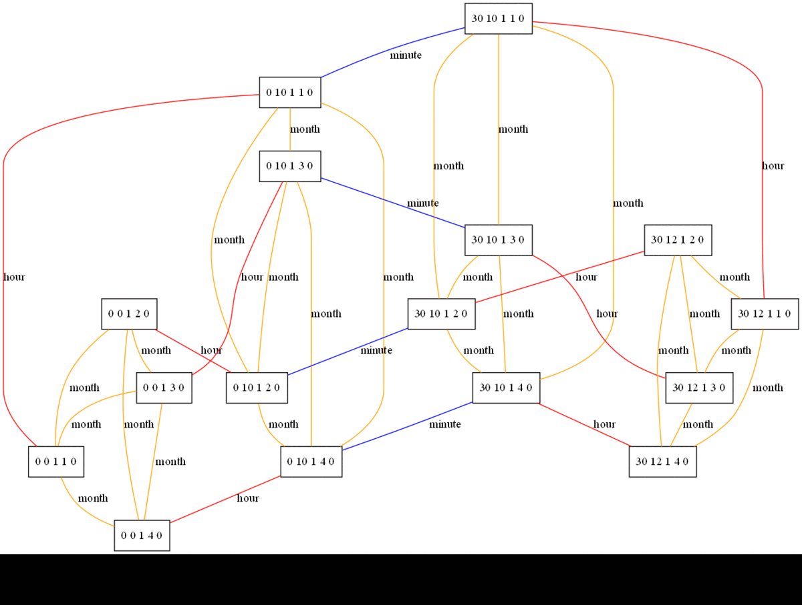

# Cron Condenser

This tool aims to reduce a list of cron expressions down to the minimum
expressions needed to describe the same intervals as the original list.

## Usage


```
java -jar cron-condenser.jar [-v] [--draw ./path-to-save-visualizations] "cron-1" "cron-2" ... "cron-n"
```

- `-v` will show more information about the problematic segments of each cron.

### Requirements
- JDK 11 or later
- graphviz

## When can 2 cron expressions be merged?

Two cron expressions can only be merged when they differ in only one segment.
For example:

```
0 0 0 JAN *
1 0 0 JAN *
```

can be merged into `0,1 0 0 JAN *` since they only differ in the `minute` segment while

```
0 0 0 JAN *
30 10 0 JAN *
```

cannot be merged. Merging them would introduce **2** new trigger times that were
not present in any of the original expressions. `0,30 0,10 0 JAN *` would also
trigger at `0 10 0 JAN *` as well as `30 0 0 JAN *`.

## Cron Expression Merge Graph

In order to merge the expressions, a graph is created in which the nodes are the
expressions themselves and the edges represent the type of merge that is
possible between two expressions. The types define the segment in which
they differ. Two expressions may only have 1 edge between them.

The process through which the expressions get condensed is an iterative process
that requires rebuilding the entire graph at each step. Every step guarantess
that 2 nodes will be removed and 1 new node will be added. The process stops when
there are no more edges connecting the nodes.

The nodes picked for each iteration are not random, the node with the least
edges is picked as the `origin` node, and the node with the least edges where at
least one is shared with the `origin` node is the `target` node. Those are then
merged to produce the new node. The idea behind this strategy is to perform the
minimally destructive merge at each step in order to maximize the number of
merges performed in total.

The figure below shows the resulting graph states after each iteration for the
following expressions as input:

```
0 0 1 JAN 0
0 10 1 JAN 0
30 10 1 JAN 0
30 12 1 JAN 0
0 0 1 FEB 0
0 10 1 FEB 0
30 10 1 FEB 0
30 12 1 FEB 0
0 0 1 MAR 0
0 10 1 MAR 0
30 10 1 MAR 0
30 12 1 MAR 0
0 0 1 APR 0
0 10 1 APR 0
30 10 1 APR 0
30 12 1 APR 0
```



## Support

Currently only standard UNIX cron expressions are supported. The format is

```
minute hour day month week-day
```

and supported features include:
- Named values (JAN, TUE)
- Step values (*/2)
- Ranges (1-5)
- Named Ranges (MON-TUE)
